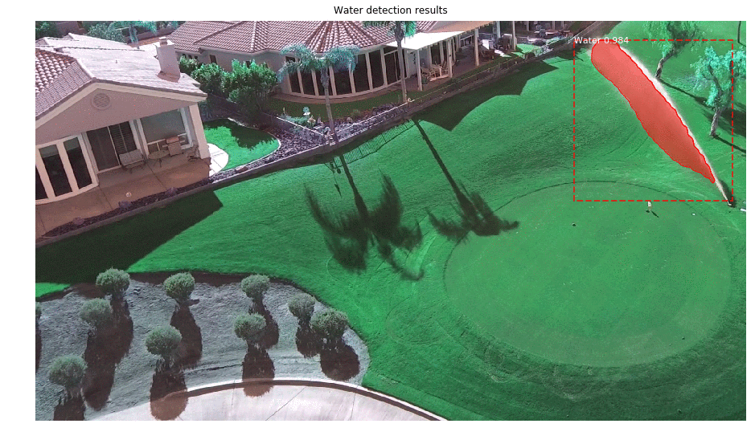

# Mask-R-CNN-for-water-detection
This is an implimentation of Mask R-CNN proposed by Facebook AI Research (Girshick et al) for water detection implemented in python3, Keras and Tensorflow based on (https://arxiv.org/abs/1703.06870). The Mask R-CNN model performes water curtain detection, draws bounding box around it and applies segmentation mask. 

The implimentation can be devided in to three steps.
* Preparation of Datasets
* Mask R-CNN Training
* Testing the Model

# 1. Preparation of dataset

 
